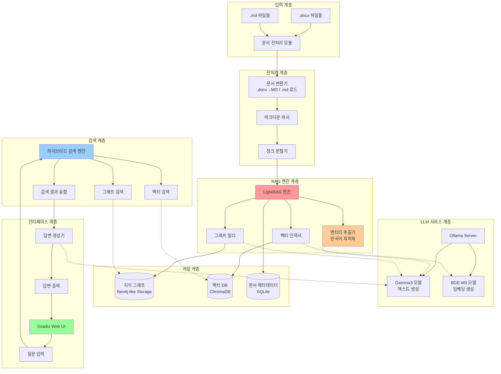
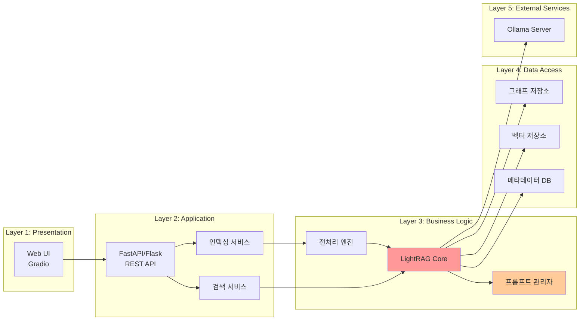
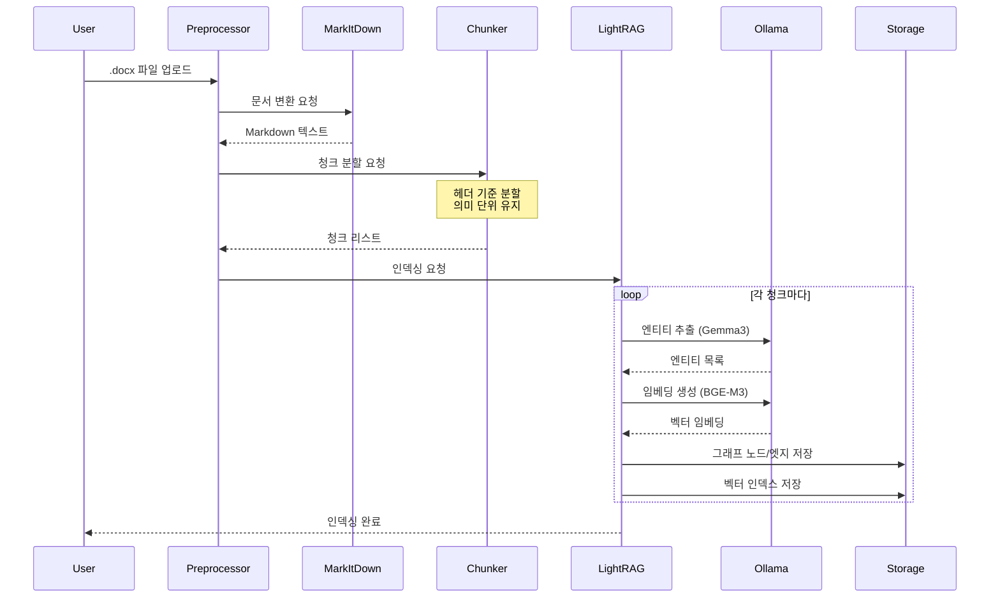
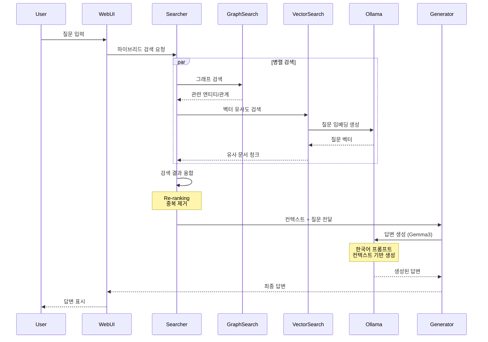
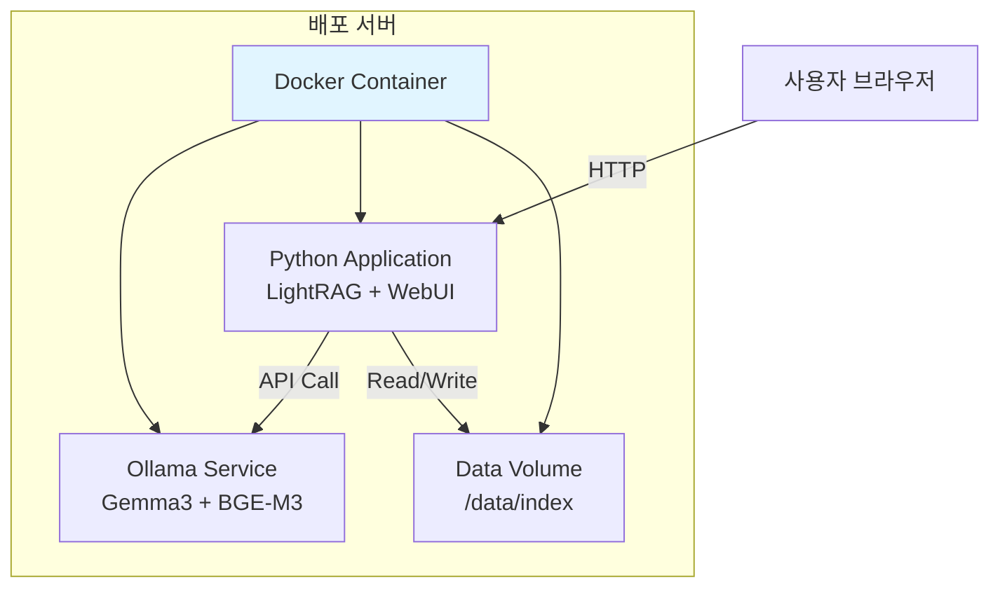

# Light GraphRAG 시스템 아키텍처 설계

## 1. 프로젝트 개요

### 1.1 목적
사내 규정 문서(.docx, .md)에 대한 질의응답이 가능한 로컬 LLM 기반 Light GraphRAG 시스템 구축

### 1.2 핵심 기술 스택
- **LLM**: Ollama + Gemma3
- **Embedding**: Ollama + bge-m3
- **RAG 프레임워크**: lightrag-hku
- **문서 변환**: markitdown
- **Web UI**: Gradio
- **언어**: Python 3.10+

---

## 2. 시스템 전체 아키텍처



---

## 3. 핵심 컴포넌트 구성

### 3.1 시스템 계층 구조



---

## 4. 주요 모듈 구성

### 4.1 프로젝트 디렉토리 구조

```
Light-Graph-RAG/
├── docs/                           # 설계 문서
│   ├── 01_시스템_아키텍처_설계.md
│   ├── 02_모듈별_상세_설계.md
│   ├── 03_데이터_플로우_설계.md
│   └── 04_API_인터페이스_명세.md
│
├── src/                            # 소스 코드
│   ├── __init__.py
│   │
│   ├── preprocessing/              # 전처리 모듈
│   │   ├── __init__.py
│   │   ├── docx_converter.py      # .docx → markdown 변환
│   │   ├── markdown_parser.py     # 마크다운 파싱 및 구조화
│   │   └── chunker.py             # 청크 분할 로직
│   │
│   ├── rag/                        # RAG 엔진 모듈
│   │   ├── __init__.py
│   │   ├── lightrag_wrapper.py    # LightRAG 초기화 및 래핑
│   │   ├── korean_prompts.py      # 한국어 최적화 프롬프트
│   │   ├── indexer.py             # 문서 인덱싱 로직
│   │   └── searcher.py            # 하이브리드 검색 구현
│   │
│   ├── llm/                        # LLM 인터페이스 모듈
│   │   ├── __init__.py
│   │   ├── ollama_client.py       # Ollama 클라이언트
│   │   └── model_config.py        # 모델 설정 관리
│   │
│   ├── webui/                      # Web UI 모듈
│   │   ├── __init__.py
│   │   ├── gradio_app.py          # Gradio 인터페이스
│   │   └── ui_components.py       # UI 컴포넌트
│   │
│   └── utils/                      # 유틸리티 모듈
│       ├── __init__.py
│       ├── config.py              # 전역 설정
│       ├── logger.py              # 로깅 유틸
│       └── validators.py          # 검증 함수
│
├── data/                           # 데이터 디렉토리
│   ├── raw/                        # 원본 .docx 파일
│   ├── processed/                  # 전처리된 마크다운
│   └── index/                      # LightRAG 인덱스 저장소
│       ├── graph/                  # 지식 그래프
│       ├── vector/                 # 벡터 DB
│       └── metadata/               # 메타데이터
│
├── tests/                          # 테스트 코드
│   ├── test_preprocessing.py
│   ├── test_rag.py
│   └── test_search.py
│
├── configs/                        # 설정 파일
│   ├── llm_config.yaml            # LLM 설정
│   ├── rag_config.yaml            # RAG 설정
│   └── prompts.yaml               # 프롬프트 템플릿
│
├── scripts/                        # 실행 스크립트
│   ├── setup.sh                   # 환경 설정
│   ├── run_preprocessing.py       # 전처리 실행
│   ├── run_indexing.py            # 인덱싱 실행
│   └── run_webui.py               # WebUI 실행
│
├── requirements.txt                # Python 의존성
├── README.md                       # 프로젝트 설명
└── .env.example                    # 환경 변수 예제
```

---

## 5. 데이터 흐름도

### 5.1 인덱싱 프로세스



### 5.2 검색 및 답변 프로세스



---

## 6. 핵심 설계 결정사항

### 6.1 한국어 프롬프트 최적화

**문제**: LightRAG의 기본 프롬프트는 영어 중심으로 설계되어 한국어 엔티티 추출 성능이 낮음

**해결책**:
```python
# src/rag/korean_prompts.py에서 커스터마이징
KOREAN_ENTITY_EXTRACTION_PROMPT = """
당신은 한국어 문서에서 핵심 개념과 엔티티를 추출하는 전문가입니다.

다음 텍스트에서 주요 엔티티(사람, 조직, 개념, 규정명 등)를 추출하고,
엔티티 간의 관계를 파악하세요.

텍스트:
{text}

출력 형식:
- 엔티티: [엔티티명, 타입]
- 관계: [엔티티1, 관계명, 엔티티2]
"""
```

### 6.2 하이브리드 검색 전략

**구성**:
1. **그래프 검색**: 엔티티 및 관계 기반 컨텍스트 탐색
2. **벡터 검색**: 의미적 유사도 기반 문서 검색
3. **결과 융합**: RRF(Reciprocal Rank Fusion) 알고리즘 사용

**구현**:
```python
# search_mode="hybrid" 설정
result = rag.query(
    question="질문",
    search_mode="hybrid",  # naive, local, global, hybrid
    top_k=10
)
```

### 6.3 청크 분할 전략

**원칙**:
- 마크다운 헤더(#, ##, ###)를 기준으로 계층적 분할
- 표(table) 구조는 분할하지 않고 하나의 청크로 유지
- 최소 청크 크기: 100자
- 최대 청크 크기: 1000자
- 오버랩: 50자 (문맥 연속성 보장)

---

## 7. 기술적 제약사항 및 고려사항

### 7.1 성능 제약
- **로컬 LLM**: Ollama 실행 시 GPU 메모리 최소 8GB 권장
- **인덱싱 속도**: Gemma3 모델 특성상 대량 문서 처리 시간 소요
- **동시 사용자**: 단일 인스턴스 기준 3-5명 동시 접속 권장

### 7.2 데이터 보안
- 모든 데이터는 로컬에서 처리 (외부 API 호출 없음)
- 사내 규정 문서의 민감성을 고려한 접근 제어 필요

### 7.3 확장성 고려
- 문서 수 증가 시 인덱스 재구성 전략 필요
- 모듈화된 설계로 향후 다른 LLM 교체 가능

---

## 8. 배포 및 운영

### 8.1 배포 환경


### 8.2 모니터링 포인트
- Ollama 서버 상태 및 응답 시간
- 인덱스 크기 및 검색 성능
- 메모리 사용량 (특히 벡터 DB)
- 사용자 질의 로그 및 답변 품질

---

## 9. 다음 단계

1. ✅ 시스템 아키텍처 설계 완료
2. ⏳ 모듈별 상세 설계 (다음 문서)
3. ⏳ 데이터 플로우 상세 설계
4. ⏳ API 인터페이스 명세
5. ⏳ 구현 및 테스트

---

**작성일**: 2026-01-17
**버전**: 1.0
**작성자**: Claude Code
