# 모듈별 상세 설계

## 목차
1. [전처리 모듈](#1-전처리-모듈)
2. [RAG 엔진 모듈](#2-rag-엔진-모듈)
3. [LLM 인터페이스 모듈](#3-llm-인터페이스-모듈)
4. [Web UI 모듈](#4-web-ui-모듈)
5. [유틸리티 모듈](#5-유틸리티-모듈)

---

## 1. 전처리 모듈

### 1.1 모듈 구조

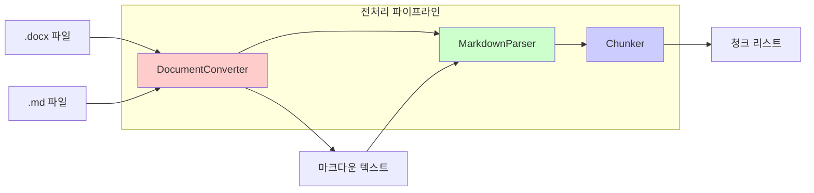

### 1.2 DocumentConverter (document_converter.py)

**책임**: .docx 및 .md 파일을 마크다운 형식으로 변환 (또는 로드)

**클래스 설계**:
```python
class DocumentConverter:
    """
    .docx 및 .md 파일을 마크다운으로 변환하는 통합 클래스
    - .docx: markitdown 라이브러리를 활용하여 표 구조를 유지하면서 변환
    - .md: 파일 내용을 그대로 로드
    """

    def __init__(self, preserve_tables: bool = True):
        """
        Args:
            preserve_tables: 표 구조 유지 여부 (기본값: True)
        """
        self.markitdown_converter = MarkItDown()
        self.preserve_tables = preserve_tables
        self.supported_formats = ['.docx', '.md']

    def convert_file(self, file_path: str) -> str:
        """
        단일 파일을 마크다운으로 변환 또는 로드

        Args:
            file_path: 파일 경로 (.docx 또는 .md)

        Returns:
            str: 마크다운 텍스트

        Raises:
            UnsupportedFormatError: 지원하지 않는 파일 형식
        """
        ext = Path(file_path).suffix.lower()

        if ext == '.docx':
            return self._convert_docx(file_path)
        elif ext == '.md':
            return self._load_markdown(file_path)
        else:
            raise UnsupportedFormatError(f"지원하지 않는 형식: {ext}")

    def convert_directory(self, dir_path: str,
                         output_dir: str = None) -> List[ConversionResult]:
        """
        디렉토리 내 모든 .docx 및 .md 파일을 일괄 변환

        Args:
            dir_path: 파일들이 있는 디렉토리 경로
            output_dir: 변환된 마크다운 저장 경로 (선택)

        Returns:
            List[ConversionResult]: 변환 결과 메타데이터 리스트
        """

    def _convert_docx(self, docx_path: str) -> str:
        """
        .docx 파일을 마크다운으로 변환

        Args:
            docx_path: .docx 파일 경로

        Returns:
            str: 변환된 마크다운 텍스트
        """

    def _load_markdown(self, md_path: str) -> str:
        """
        .md 파일을 로드

        Args:
            md_path: .md 파일 경로

        Returns:
            str: 마크다운 텍스트
        """

    def _post_process_markdown(self, markdown_text: str) -> str:
        """
        변환된 마크다운 후처리
        - 불필요한 공백 제거
        - 표 포맷팅 정규화
        - 헤더 계층 구조 검증
        """
```

**주요 처리 로직**:
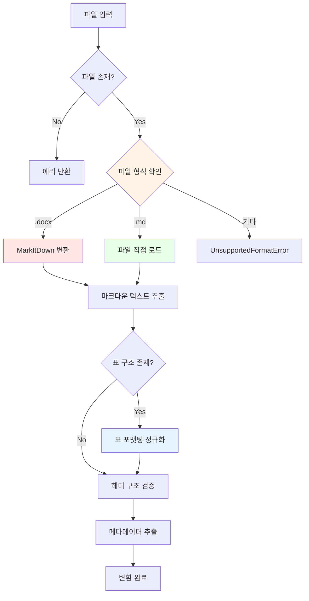

**메타데이터 구조**:
```python
{
    "original_path": "/path/to/file.docx",  # 또는 file.md
    "filename": "사내규정_001.docx",         # 또는 규정.md
    "file_format": "docx",                   # 또는 "md"
    "markdown_path": "/path/to/output.md",
    "converted_at": "2026-01-17T12:00:00",
    "file_size": 52480,
    "has_tables": True,
    "header_count": 15,
    "encoding": "utf-8",
    "conversion_required": True              # .docx는 True, .md는 False
}
```

---

### 1.3 MarkdownParser (markdown_parser.py)

**책임**: 마크다운 텍스트를 구조화된 문서 객체로 파싱

**클래스 설계**:
```python
class MarkdownDocument:
    """마크다운 문서를 표현하는 데이터 클래스"""

    def __init__(self):
        self.sections: List[Section] = []
        self.metadata: Dict = {}

class Section:
    """문서의 한 섹션을 표현"""

    def __init__(self, level: int, title: str, content: str):
        self.level = level          # 헤더 레벨 (1-6)
        self.title = title          # 섹션 제목
        self.content = content      # 섹션 내용
        self.subsections: List[Section] = []
        self.has_table = False
        self.table_data: List[Dict] = []

class MarkdownParser:
    """마크다운 텍스트를 파싱하여 구조화"""

    def parse(self, markdown_text: str) -> MarkdownDocument:
        """
        마크다운 텍스트를 파싱

        Args:
            markdown_text: 마크다운 형식의 텍스트

        Returns:
            MarkdownDocument: 구조화된 문서 객체
        """

    def _extract_sections(self, text: str) -> List[Section]:
        """헤더를 기준으로 섹션 추출"""

    def _parse_tables(self, section_content: str) -> List[Dict]:
        """섹션 내 표 데이터 파싱"""

    def _build_hierarchy(self, sections: List[Section]) -> List[Section]:
        """섹션 간 계층 구조 구축"""
```

**파싱 로직**:
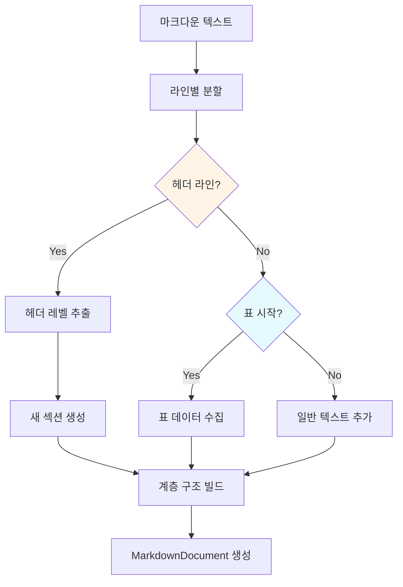

---

### 1.4 Chunker (chunker.py)

**책임**: 구조화된 문서를 의미 단위의 청크로 분할

**클래스 설계**:
```python
class ChunkConfig:
    """청크 분할 설정"""
    min_chunk_size: int = 100        # 최소 청크 크기 (문자)
    max_chunk_size: int = 1000       # 최대 청크 크기 (문자)
    overlap_size: int = 50           # 오버랩 크기 (문자)
    preserve_tables: bool = True     # 표 보존 여부
    split_by_header: bool = True     # 헤더 기준 분할 여부

class Chunk:
    """청크 데이터 클래스"""

    def __init__(self):
        self.id: str = ""                    # 고유 ID
        self.content: str = ""               # 청크 내용
        self.metadata: Dict = {}             # 메타데이터
        self.source_section: str = ""        # 원본 섹션 경로
        self.chunk_type: str = "text"        # text, table, mixed

class Chunker:
    """의미 단위 청크 분할기"""

    def __init__(self, config: ChunkConfig = None):
        self.config = config or ChunkConfig()

    def chunk_document(self, doc: MarkdownDocument) -> List[Chunk]:
        """
        문서를 청크로 분할

        Args:
            doc: 파싱된 마크다운 문서

        Returns:
            List[Chunk]: 청크 리스트
        """

    def _chunk_section(self, section: Section) -> List[Chunk]:
        """단일 섹션을 청크로 분할"""

    def _split_long_text(self, text: str) -> List[str]:
        """긴 텍스트를 최대 크기 기준으로 분할 (오버랩 적용)"""

    def _create_chunk_id(self, section_path: str, index: int) -> str:
        """청크 고유 ID 생성"""
```

**청크 분할 전략**:
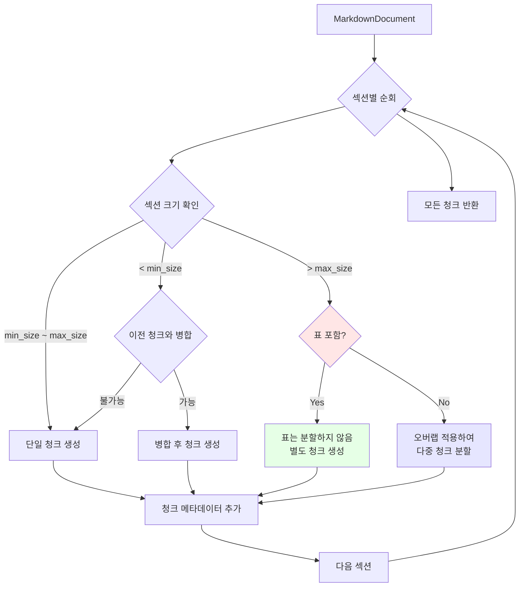

**청크 메타데이터 구조**:
```python
{
    "chunk_id": "doc001_sec02_chunk003",
    "source_file": "사내규정_001.docx",
    "section_path": "1. 총칙 > 1.2 용어의 정의",
    "header_level": 2,
    "chunk_index": 3,
    "total_chunks": 5,
    "chunk_type": "text",  # text, table, mixed
    "has_table": False,
    "char_count": 456,
    "created_at": "2026-01-17T12:00:00"
}
```

---

## 2. RAG 엔진 모듈

### 2.1 모듈 구조

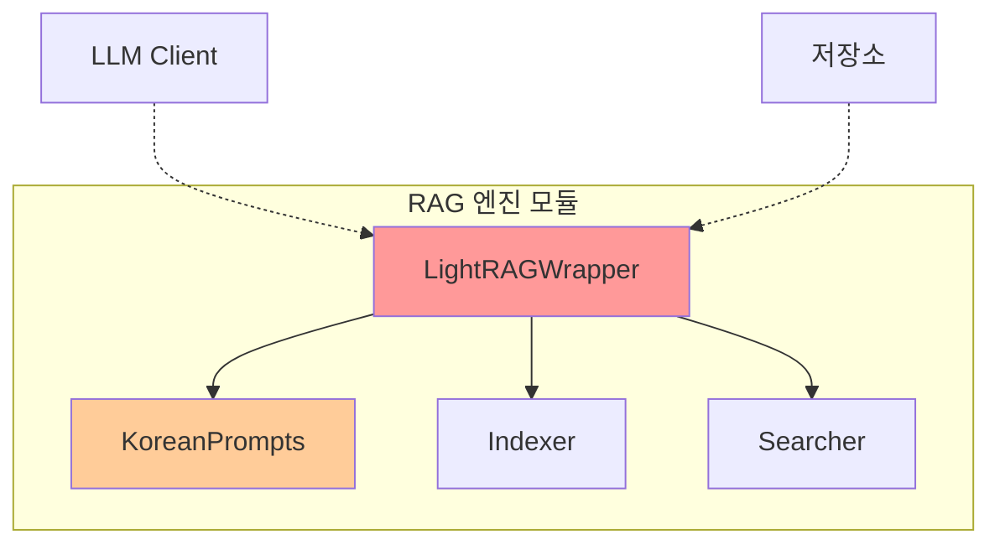

### 2.2 LightRAGWrapper (lightrag_wrapper.py)

**책임**: LightRAG 라이브러리를 래핑하고 한국어 최적화 적용

**클래스 설계**:
```python
class LightRAGWrapper:
    """
    LightRAG를 래핑하여 한국어 최적화 및 커스터마이징 적용
    """

    def __init__(self,
                 working_dir: str,
                 llm_model: str = "gemma3:latest",
                 embedding_model: str = "bge-m3:latest",
                 ollama_host: str = "http://localhost:11434"):
        """
        Args:
            working_dir: 인덱스 저장 디렉토리
            llm_model: Ollama LLM 모델명
            embedding_model: Ollama 임베딩 모델명
            ollama_host: Ollama 서버 주소
        """

        self.working_dir = working_dir
        self.llm_model = llm_model
        self.embedding_model = embedding_model

        # LightRAG 초기화
        self.rag = LightRAG(
            working_dir=working_dir,
            llm_model_func=self._create_llm_func(),
            embedding_func=self._create_embedding_func(),
        )

        # 한국어 프롬프트 적용
        self._apply_korean_prompts()

    def _create_llm_func(self):
        """Ollama LLM 함수 생성"""

    def _create_embedding_func(self):
        """Ollama 임베딩 함수 생성"""

    def _apply_korean_prompts(self):
        """한국어 최적화 프롬프트 적용"""
        from .korean_prompts import (
            KOREAN_ENTITY_EXTRACTION_PROMPT,
            KOREAN_RELATIONSHIP_PROMPT,
            KOREAN_ANSWER_GENERATION_PROMPT
        )

        # LightRAG 내부 프롬프트 교체
        self.rag.entity_extraction_prompt = KOREAN_ENTITY_EXTRACTION_PROMPT
        self.rag.relationship_extraction_prompt = KOREAN_RELATIONSHIP_PROMPT
        self.rag.answer_generation_prompt = KOREAN_ANSWER_GENERATION_PROMPT
```

**LightRAG 초기화 흐름**:
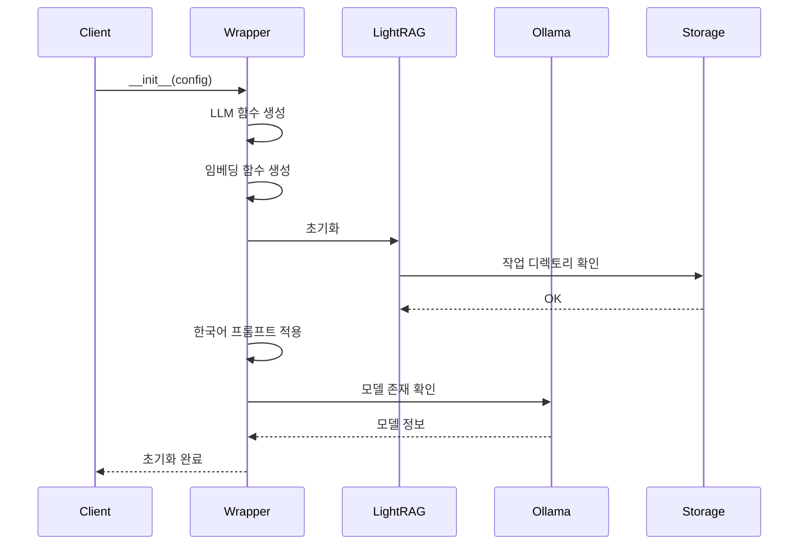

---

### 2.3 KoreanPrompts (korean_prompts.py)

**책임**: 한국어에 최적화된 프롬프트 템플릿 제공

**프롬프트 설계**:

#### 2.3.1 엔티티 추출 프롬프트

```python
KOREAN_ENTITY_EXTRACTION_PROMPT = """
당신은 한국어 문서에서 핵심 개념과 엔티티를 추출하는 전문가입니다.

주어진 텍스트에서 다음 유형의 엔티티를 추출하세요:
1. **조직**: 회사, 부서, 팀 등
2. **인물**: 직책, 역할 등
3. **개념**: 규정명, 정책명, 제도명 등
4. **날짜/기간**: 구체적인 날짜, 기간 정보
5. **수치**: 금액, 일수, 비율 등 구체적 수치
6. **절차**: 업무 프로세스, 단계 등

텍스트:
---
{text}
---

출력 형식 (JSON):
{{
  "entities": [
    {{
      "name": "엔티티명",
      "type": "조직|인물|개념|날짜|수치|절차",
      "description": "간단한 설명"
    }}
  ]
}}

주의사항:
- 모든 출력은 한국어로 작성
- 동일한 의미를 가진 엔티티는 하나로 통합
- 엔티티명은 문서에 나온 원문 그대로 사용
"""
```

#### 2.3.2 관계 추출 프롬프트

```python
KOREAN_RELATIONSHIP_PROMPT = """
다음 엔티티들 사이의 관계를 파악하여 추출하세요.

엔티티 목록:
{entities}

텍스트:
---
{text}
---

관계 유형:
- 소속: A는 B에 소속됨
- 규정: A는 B에 의해 규정됨
- 절차: A 이후 B가 진행됨
- 조건: A인 경우 B가 적용됨
- 기준: A는 B를 기준으로 함
- 참조: A는 B를 참조함

출력 형식 (JSON):
{{
  "relationships": [
    {{
      "source": "엔티티1",
      "relation": "관계 유형",
      "target": "엔티티2",
      "context": "관계에 대한 설명"
    }}
  ]
}}

주의사항:
- 텍스트에 명시적으로 드러난 관계만 추출
- 추론이나 가정은 배제
"""
```

#### 2.3.3 답변 생성 프롬프트

```python
KOREAN_ANSWER_GENERATION_PROMPT = """
당신은 사내 규정 전문가입니다. 주어진 컨텍스트를 바탕으로 질문에 정확하게 답변하세요.

질문:
{question}

관련 컨텍스트:
---
{context}
---

답변 작성 지침:
1. 컨텍스트에 근거하여 정확하게 답변
2. 규정명, 조항 등을 명시하여 신뢰성 제공
3. 모호한 경우 "명확하지 않음"이라고 표시
4. 컨텍스트에 없는 내용은 추측하지 말것
5. 답변은 간결하고 명확하게 (3-5문장)

답변:
"""
```

**프롬프트 커스터마이징 구조**:
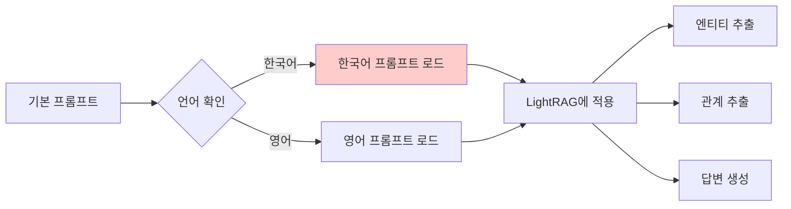

---

### 2.4 Indexer (indexer.py)

**책임**: 청크 데이터를 LightRAG 인덱스에 저장

**클래스 설계**:
```python
class IndexingConfig:
    """인덱싱 설정"""
    batch_size: int = 10              # 배치 크기
    show_progress: bool = True        # 진행률 표시
    retry_on_error: bool = True       # 에러 시 재시도
    max_retries: int = 3              # 최대 재시도 횟수

class Indexer:
    """문서 인덱싱 관리자"""

    def __init__(self,
                 rag_wrapper: LightRAGWrapper,
                 config: IndexingConfig = None):
        self.rag = rag_wrapper
        self.config = config or IndexingConfig()

    def index_chunks(self, chunks: List[Chunk]) -> IndexingResult:
        """
        청크 리스트를 인덱싱

        Args:
            chunks: 청크 리스트

        Returns:
            IndexingResult: 인덱싱 결과
        """

    def index_batch(self, chunk_batch: List[Chunk]) -> bool:
        """청크 배치를 인덱싱"""

    def _handle_indexing_error(self, chunk: Chunk, error: Exception):
        """인덱싱 에러 처리"""
```

**인덱싱 프로세스**:
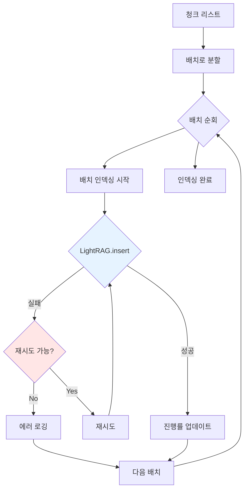

---

### 2.5 Searcher (searcher.py)

**책임**: 하이브리드 검색 수행 및 결과 융합

**클래스 설계**:
```python
class SearchConfig:
    """검색 설정"""
    search_mode: str = "hybrid"       # naive, local, global, hybrid
    top_k: int = 10                   # 상위 K개 결과
    rerank: bool = True               # 재순위화 여부
    min_relevance_score: float = 0.5  # 최소 관련성 점수

class SearchResult:
    """검색 결과"""

    def __init__(self):
        self.query: str = ""
        self.chunks: List[Chunk] = []
        self.entities: List[str] = []
        self.relationships: List[Dict] = []
        self.relevance_scores: List[float] = []
        self.answer: str = ""

class Searcher:
    """하이브리드 검색 엔진"""

    def __init__(self,
                 rag_wrapper: LightRAGWrapper,
                 config: SearchConfig = None):
        self.rag = rag_wrapper
        self.config = config or SearchConfig()

    def search(self, query: str) -> SearchResult:
        """
        하이브리드 검색 수행

        Args:
            query: 검색 질의

        Returns:
            SearchResult: 검색 결과
        """

    def _rerank_results(self, results: List) -> List:
        """검색 결과 재순위화 (RRF 알고리즘)"""
```

**하이브리드 검색 흐름**:
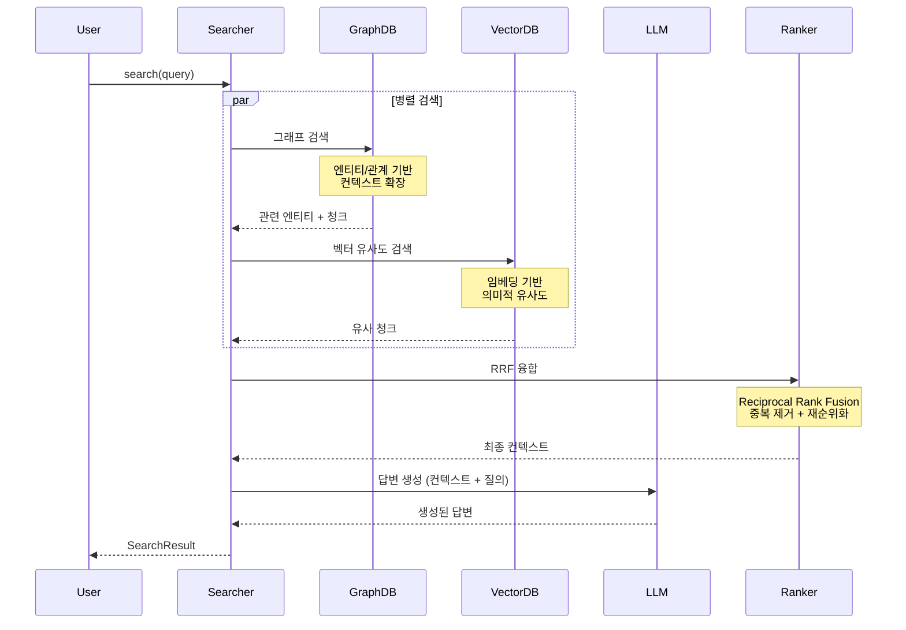

**RRF (Reciprocal Rank Fusion) 알고리즘**:
```python
def reciprocal_rank_fusion(
    graph_results: List[Tuple[Chunk, float]],
    vector_results: List[Tuple[Chunk, float]],
    k: int = 60
) -> List[Tuple[Chunk, float]]:
    """
    RRF 공식:
    RRF_score(d) = Σ 1/(k + rank_i(d))

    여기서:
    - d: 문서 (청크)
    - rank_i(d): i번째 검색 결과에서 d의 순위
    - k: 상수 (기본값 60)
    """
    scores = defaultdict(float)

    # 그래프 검색 결과 점수 계산
    for rank, (chunk, _) in enumerate(graph_results, start=1):
        scores[chunk.id] += 1.0 / (k + rank)

    # 벡터 검색 결과 점수 계산
    for rank, (chunk, _) in enumerate(vector_results, start=1):
        scores[chunk.id] += 1.0 / (k + rank)

    # 점수 기준 정렬
    return sorted(scores.items(), key=lambda x: x[1], reverse=True)
```

---

## 3. LLM 인터페이스 모듈

### 3.1 OllamaClient (ollama_client.py)

**책임**: Ollama 서버와의 통신 관리

**클래스 설계**:
```python
class OllamaClient:
    """Ollama API 클라이언트"""

    def __init__(self, host: str = "http://localhost:11434"):
        self.host = host
        self.client = ollama.Client(host=host)

    def generate(self,
                 model: str,
                 prompt: str,
                 stream: bool = False,
                 **kwargs) -> str:
        """
        텍스트 생성

        Args:
            model: 모델명 (예: gemma3:latest)
            prompt: 입력 프롬프트
            stream: 스트리밍 여부

        Returns:
            str: 생성된 텍스트
        """

    def embed(self,
              model: str,
              text: str) -> List[float]:
        """
        임베딩 생성

        Args:
            model: 임베딩 모델명 (예: bge-m3:latest)
            text: 임베딩할 텍스트

        Returns:
            List[float]: 임베딩 벡터
        """

    def list_models(self) -> List[str]:
        """사용 가능한 모델 목록 조회"""

    def check_health(self) -> bool:
        """Ollama 서버 상태 확인"""
```

**에러 처리**:
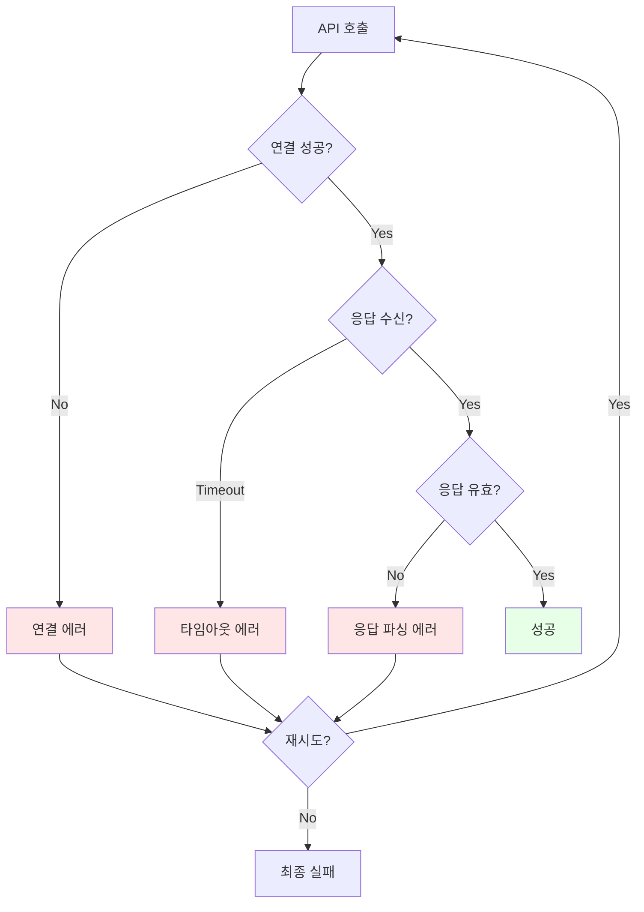

---

## 4. Web UI 모듈

### 4.1 GradioApp (gradio_app.py)

**책임**: 사용자 인터페이스 제공

**UI 구성**:
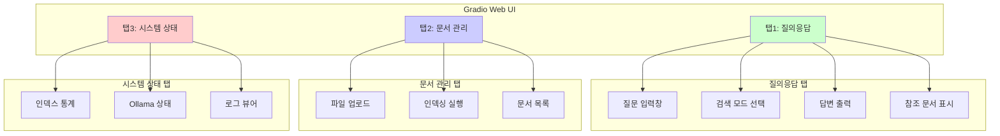

**UI 코드 구조**:
```python
class GradioApp:
    """Gradio 웹 인터페이스"""

    def __init__(self, searcher: Searcher, indexer: Indexer):
        self.searcher = searcher
        self.indexer = indexer

    def create_app(self) -> gr.Blocks:
        """Gradio 앱 생성"""

        with gr.Blocks(title="사내규정 Q&A") as app:

            # 탭 1: 질의응답
            with gr.Tab("질의응답"):
                query_input = gr.Textbox(
                    label="질문을 입력하세요",
                    placeholder="예: 연차 사용 규정은?"
                )

                search_mode = gr.Radio(
                    choices=["hybrid", "local", "global", "naive"],
                    value="hybrid",
                    label="검색 모드"
                )

                submit_btn = gr.Button("검색", variant="primary")

                answer_output = gr.Textbox(
                    label="답변",
                    lines=10
                )

                references = gr.JSON(label="참조 문서")

                submit_btn.click(
                    fn=self.handle_query,
                    inputs=[query_input, search_mode],
                    outputs=[answer_output, references]
                )

            # 탭 2: 문서 관리
            with gr.Tab("문서 관리"):
                file_upload = gr.Files(
                    label="DOCX 파일 업로드",
                    file_types=[".docx"]
                )

                index_btn = gr.Button("인덱싱 시작")
                progress = gr.Progress()
                status = gr.Textbox(label="상태")

                index_btn.click(
                    fn=self.handle_indexing,
                    inputs=[file_upload],
                    outputs=[status]
                )

            # 탭 3: 시스템 상태
            with gr.Tab("시스템 상태"):
                refresh_btn = gr.Button("새로고침")
                stats = gr.JSON(label="인덱스 통계")
                ollama_status = gr.Textbox(label="Ollama 상태")

                refresh_btn.click(
                    fn=self.get_system_status,
                    outputs=[stats, ollama_status]
                )

        return app

    def handle_query(self, query: str, mode: str):
        """질의 처리"""

    def handle_indexing(self, files: List):
        """인덱싱 처리"""

    def get_system_status(self):
        """시스템 상태 조회"""
```

---

## 5. 유틸리티 모듈

### 5.1 Config (config.py)

**전역 설정 관리**:
```python
from dataclasses import dataclass
from pathlib import Path

@dataclass
class PathConfig:
    """경로 설정"""
    project_root: Path
    data_dir: Path
    raw_dir: Path
    processed_dir: Path
    index_dir: Path

@dataclass
class LLMConfig:
    """LLM 설정"""
    ollama_host: str = "http://localhost:11434"
    llm_model: str = "gemma3:latest"
    embedding_model: str = "bge-m3:latest"
    temperature: float = 0.7
    max_tokens: int = 2048

@dataclass
class RAGConfig:
    """RAG 설정"""
    search_mode: str = "hybrid"
    top_k: int = 10
    chunk_size: int = 1000
    chunk_overlap: int = 50

class Config:
    """전역 설정"""

    def __init__(self, config_file: str = None):
        self.paths = PathConfig(...)
        self.llm = LLMConfig()
        self.rag = RAGConfig()

        if config_file:
            self.load_from_yaml(config_file)
```

### 5.2 Logger (logger.py)

**로깅 유틸리티**:
```python
import logging
from pathlib import Path

def setup_logger(name: str, log_file: Path = None) -> logging.Logger:
    """
    로거 설정

    Args:
        name: 로거 이름
        log_file: 로그 파일 경로

    Returns:
        logging.Logger: 설정된 로거
    """

    logger = logging.getLogger(name)
    logger.setLevel(logging.INFO)

    # 콘솔 핸들러
    console_handler = logging.StreamHandler()
    console_handler.setLevel(logging.INFO)

    # 파일 핸들러
    if log_file:
        file_handler = logging.FileHandler(log_file, encoding='utf-8')
        file_handler.setLevel(logging.DEBUG)
        logger.addHandler(file_handler)

    # 포맷터
    formatter = logging.Formatter(
        '%(asctime)s - %(name)s - %(levelname)s - %(message)s'
    )
    console_handler.setFormatter(formatter)

    logger.addHandler(console_handler)

    return logger
```

---

## 다음 단계

모듈별 상세 설계가 완료되었습니다. 다음 문서에서는:
- 데이터 플로우 상세 분석
- API 인터페이스 명세
- 구현 가이드

를 다루겠습니다.

**작성일**: 2026-01-17
**버전**: 1.0
