# 데이터 플로우 설계

## 목차
1. [전체 데이터 흐름](#1-전체-데이터-흐름)
2. [인덱싱 파이프라인](#2-인덱싱-파이프라인)
3. [검색 파이프라인](#3-검색-파이프라인)
4. [데이터 변환 프로세스](#4-데이터-변환-프로세스)
5. [저장소 구조](#5-저장소-구조)

---

## 1. 전체 데이터 흐름

### 1.1 시스템 레벨 데이터 흐름

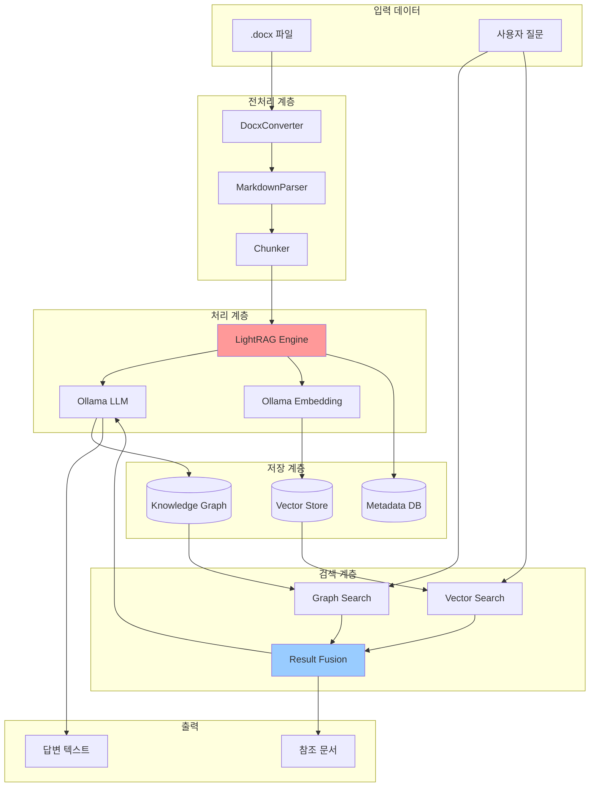

### 1.2 데이터 변환 단계

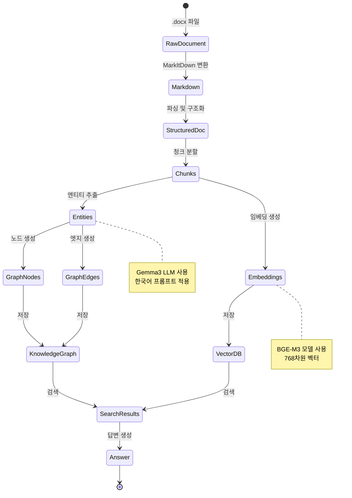

---

## 2. 인덱싱 파이프라인

### 2.1 상세 인덱싱 흐름

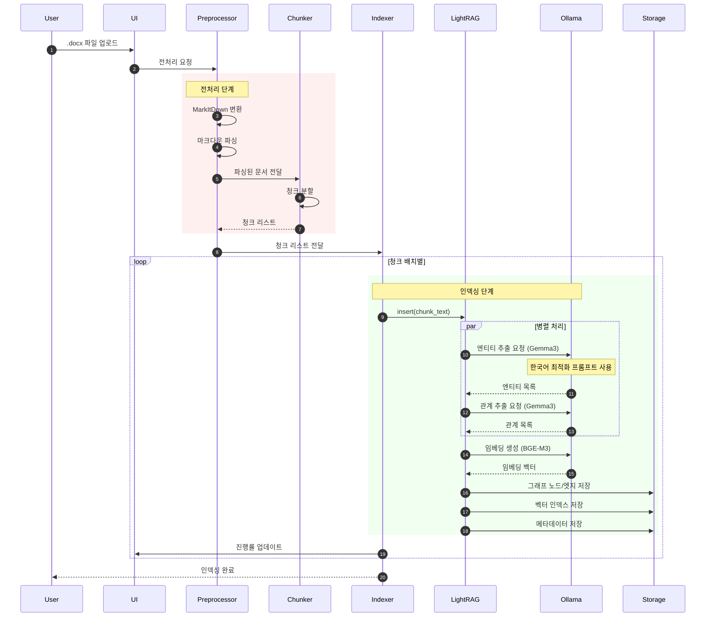

### 2.2 청크별 데이터 처리

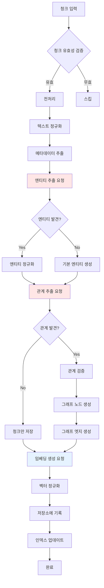

### 2.3 엔티티 추출 상세 프로세스

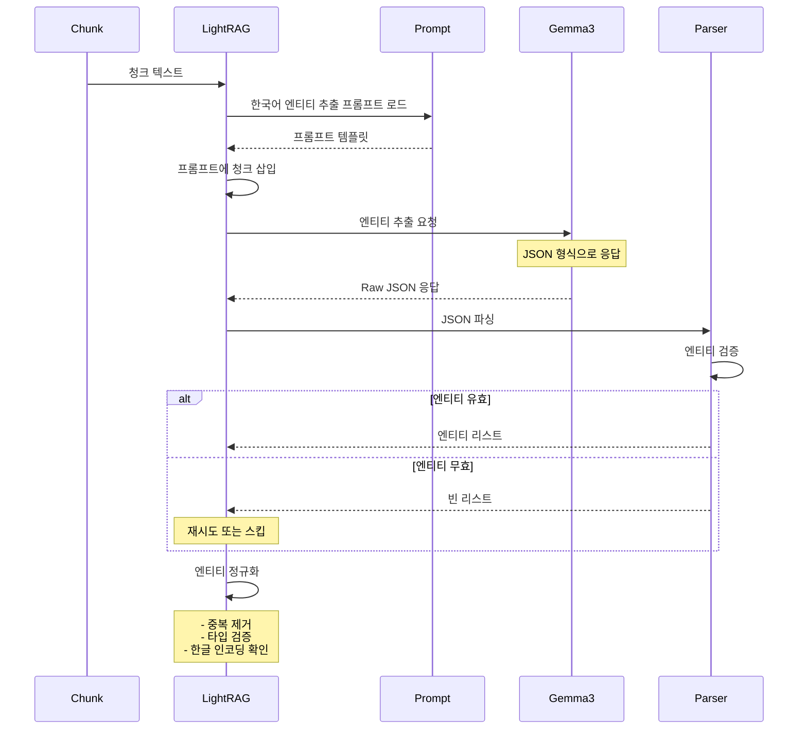

---

## 3. 검색 파이프라인

### 3.1 하이브리드 검색 상세 흐름

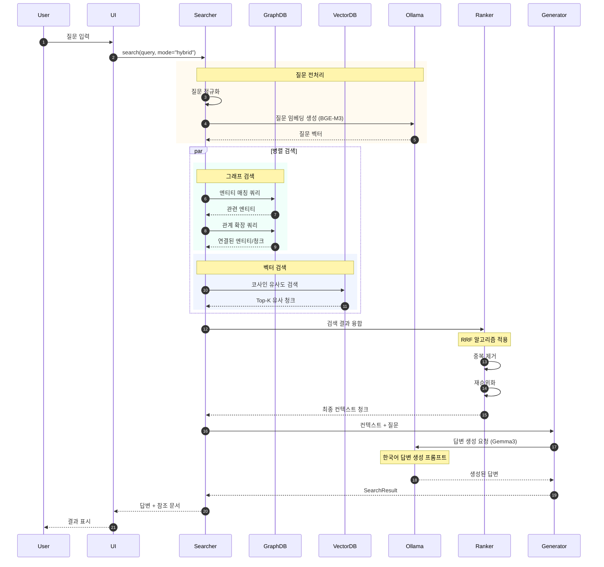

### 3.2 검색 모드별 차이

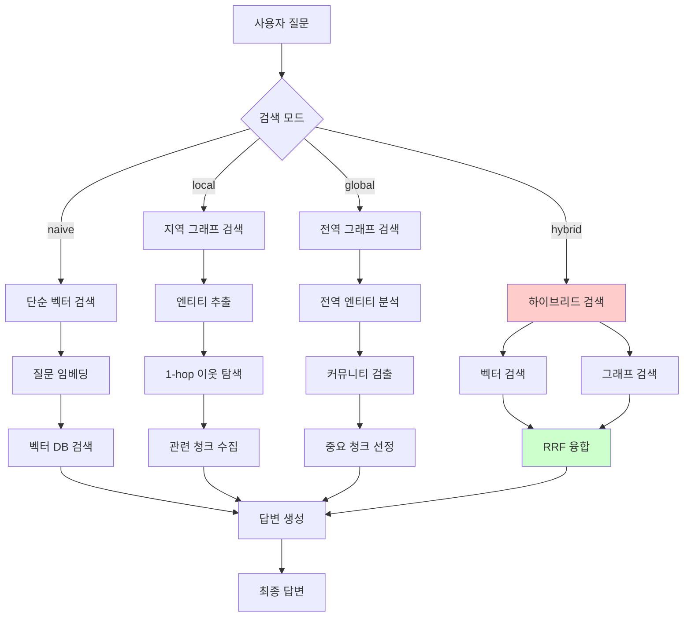

### 3.3 RRF 융합 알고리즘 상세

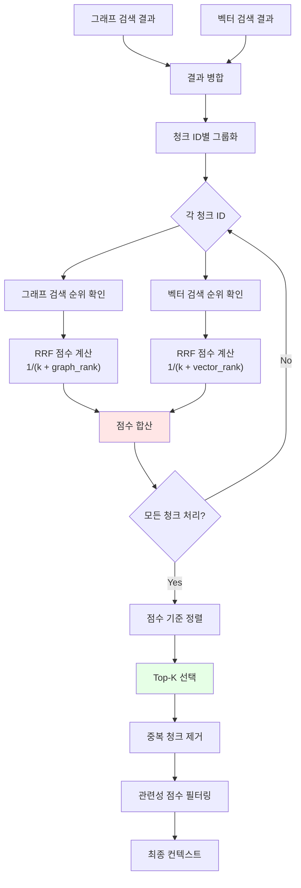

**RRF 점수 계산 예시**:
```
k = 60 (상수)

청크 A:
- 그래프 검색 순위: 3위
- 벡터 검색 순위: 5위
- RRF 점수 = 1/(60+3) + 1/(60+5) = 0.0159 + 0.0154 = 0.0313

청크 B:
- 그래프 검색 순위: 1위
- 벡터 검색 순위: 10위
- RRF 점수 = 1/(60+1) + 1/(60+10) = 0.0164 + 0.0143 = 0.0307

청크 C:
- 그래프 검색 순위: 없음
- 벡터 검색 순위: 2위
- RRF 점수 = 0 + 1/(60+2) = 0.0161

정렬 결과: B(0.0313) > A(0.0307) > C(0.0161)
```

---

## 4. 데이터 변환 프로세스

### 4.1 .docx → Markdown 변환

```mermaid
flowchart LR
    A[.docx 파일] --> B[MarkItDown]

    B --> C{요소 타입}

    C -->|텍스트| D[일반 텍스트<br/>마크다운 변환]
    C -->|제목| E["헤더 변환<br/># ## ###"]
    C -->|표| F[Markdown Table<br/>구조 유지]
    C -->|이미지| G[이미지 링크<br/>변환]
    C -->|목록| H[리스트 변환<br/>- 1."]

    D --> I[Markdown 텍스트]
    E --> I
    F --> I
    G --> I
    H --> I

    I --> J[후처리]
    J --> K[최종 Markdown]

    style F fill:#ffe6e6
    Note: "표 구조 유지 필수"
```

**변환 예시**:
```markdown
입력 (.docx):
┌─────────────────────────────┐
│ 제1장 총칙                  │
│                             │
│ 제1조 (목적)                │
│ 이 규정은 회사의...         │
│                             │
│ ┌────┬────┬────┐            │
│ │구분│일수│비고│            │
│ ├────┼────┼────┤            │
│ │연차│15일│    │            │
│ └────┴────┴────┘            │
└─────────────────────────────┘

출력 (Markdown):
# 제1장 총칙

## 제1조 (목적)

이 규정은 회사의...

| 구분 | 일수 | 비고 |
|------|------|------|
| 연차 | 15일 |      |
```

### 4.2 Markdown → 구조화된 문서

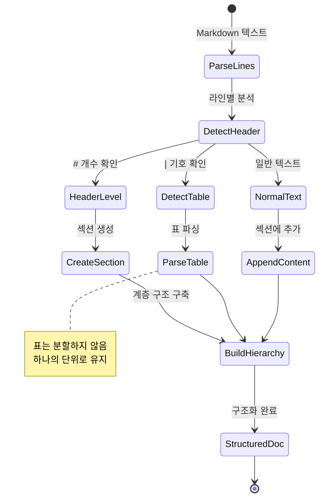

### 4.3 구조화된 문서 → 청크

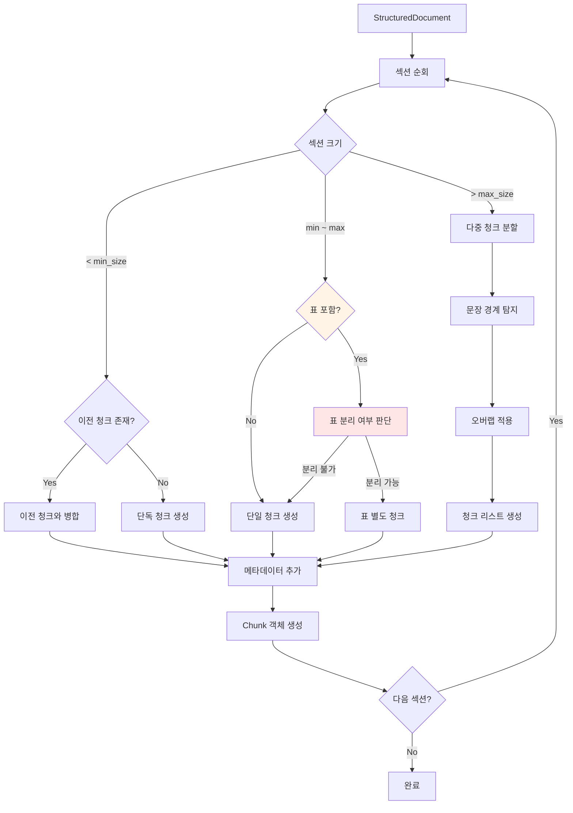

**청크 분할 예시**:
```
섹션: "제2조 연차 사용 규정" (1200자)

오버랩 전략:
┌──────────────────────┐
│ 청크 1 (1000자)      │
│                      │
│   ┌─────┐ (50자)    │
│   │오버랩│            │
└───┴─────┴────────────┘
        ┌──────────────┐
        │ 청크 2 (250자)│
        └──────────────┘

청크 1: "제2조 연차 사용 규정. 직원은 1년..." (1000자)
청크 2: "...연차를 사용할 수 있다. 단, 부서장의 승인..." (250자)

오버랩 부분: "...연차를 사용할 수 있다." (50자)
```

---

## 5. 저장소 구조

### 5.1 LightRAG 저장소 구조

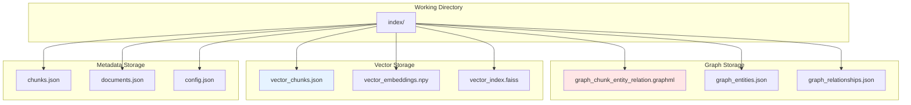

### 5.2 지식 그래프 구조

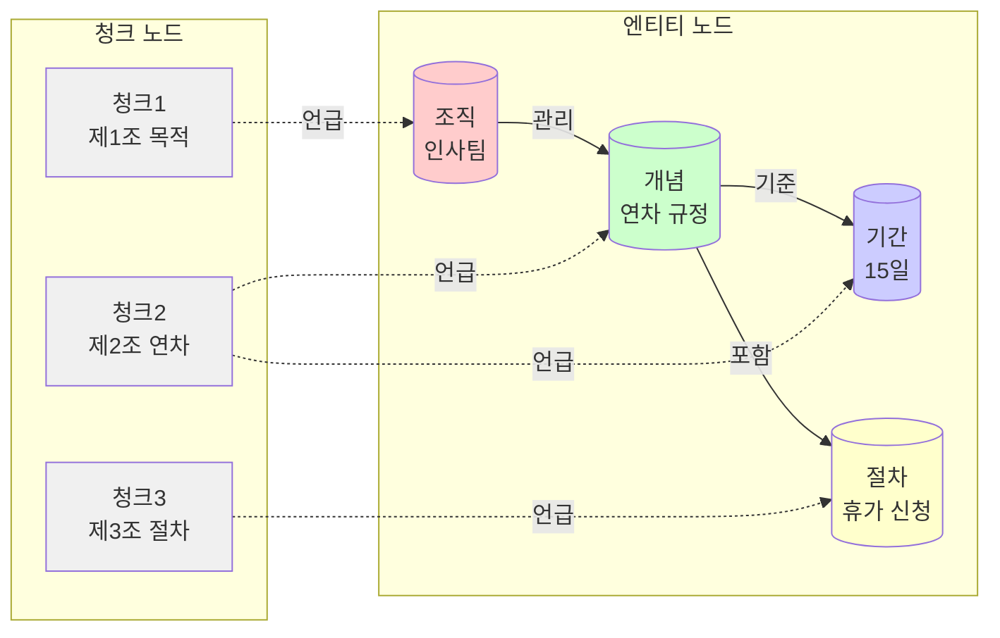

### 5.3 벡터 저장소 구조

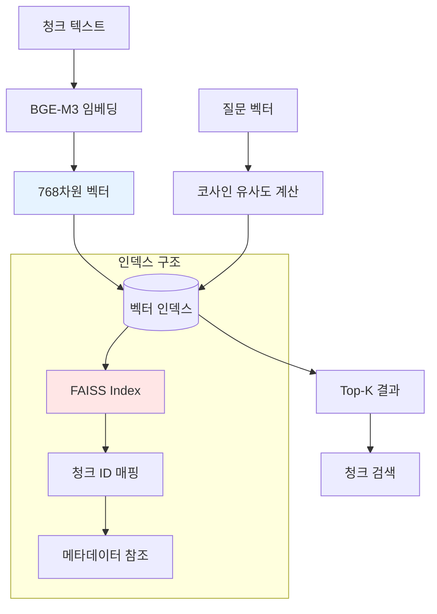

**벡터 차원 구조**:
```
청크 벡터:
[0.023, -0.145, 0.892, ..., 0.456]
 ↑                            ↑
 차원 0                    차원 767
 (총 768차원)

유사도 계산:
cosine_similarity(query_vec, chunk_vec) = dot(q, c) / (||q|| * ||c||)

범위: -1 ~ 1
  1: 완전 유사
  0: 무관
 -1: 완전 반대
```

### 5.4 메타데이터 구조

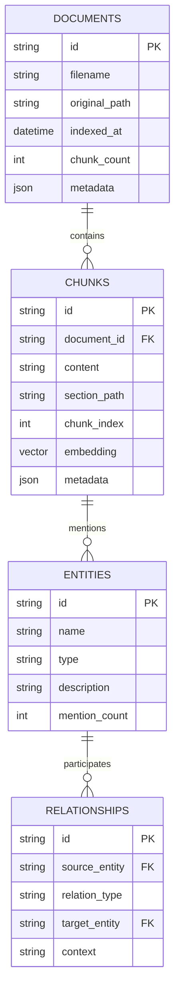

---

## 6. 성능 최적화 전략

### 6.1 인덱싱 최적화

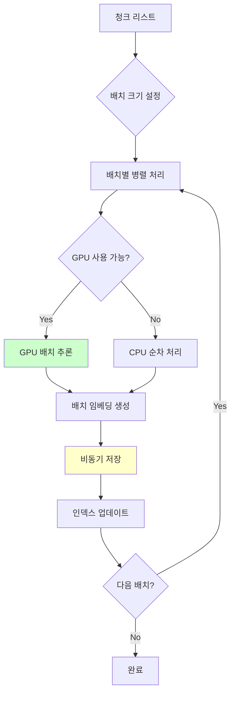

### 6.2 검색 최적화

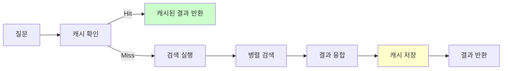

---

## 7. 에러 처리 및 복구

### 7.1 에러 처리 흐름

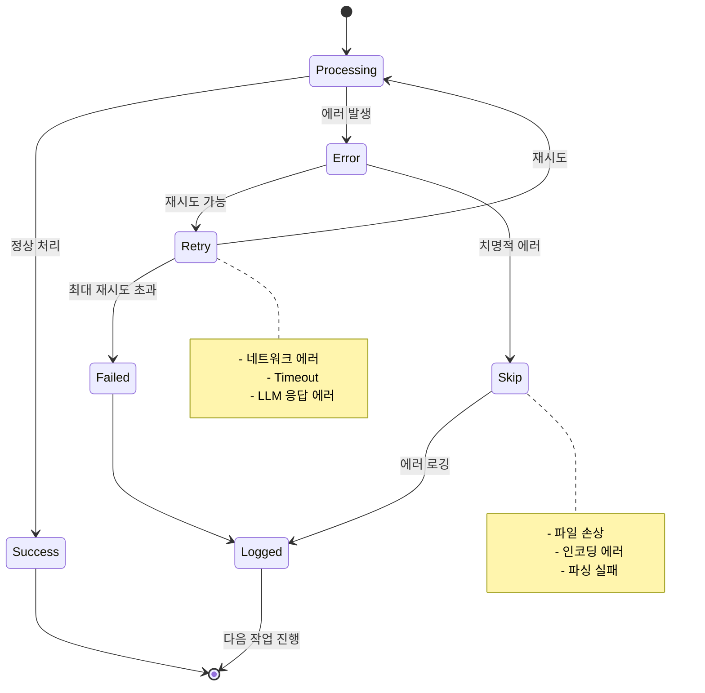

---

**작성일**: 2026-01-17
**버전**: 1.0
