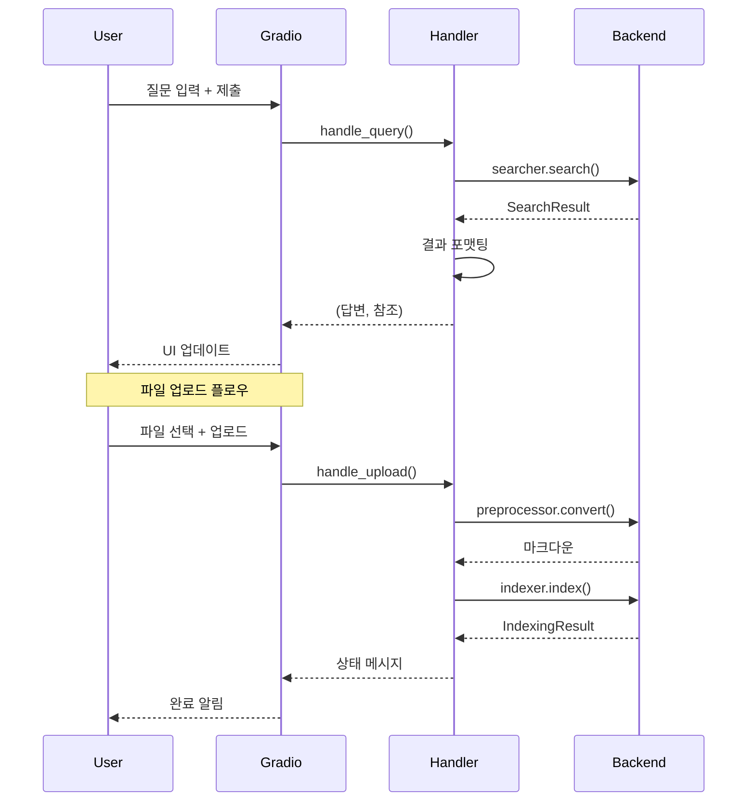

# API 인터페이스 명세

## 목차
1. [전처리 API](#1-전처리-api)
2. [인덱싱 API](#2-인덱싱-api)
3. [검색 API](#3-검색-api)
4. [관리 API](#4-관리-api)
5. [내부 인터페이스](#5-내부-인터페이스)
6. [데이터 모델](#6-데이터-모델)

---

## 1. 전처리 API

### 1.1 DocumentConverter

#### convert_file()

```python
def convert_file(self, file_path: str) -> str:
    """
    단일 파일을 마크다운으로 변환 또는 로드

    Args:
        file_path (str): 파일의 절대 경로 (.docx 또는 .md)

    Returns:
        str: 마크다운 텍스트

    Raises:
        FileNotFoundError: 파일이 존재하지 않을 때
        PermissionError: 파일 읽기 권한이 없을 때
        UnsupportedFormatError: 지원하지 않는 파일 형식
        MarkdownConversionError: 변환 실패 시

    Example:
        >>> converter = DocumentConverter()

        # .docx 파일 변환
        >>> markdown = converter.convert_file("/path/to/규정.docx")
        >>> print(markdown[:100])
        # 제1장 총칙
        ## 제1조 (목적)
        이 규정은...

        # .md 파일 로드
        >>> markdown = converter.convert_file("/path/to/규정.md")
        >>> print(markdown[:100])
        # 제1장 총칙...
    """
```

#### convert_directory()

```python
def convert_directory(
    self,
    dir_path: str,
    output_dir: str = None,
    recursive: bool = False
) -> List[ConversionResult]:
    """
    디렉토리 내 모든 .docx 및 .md 파일을 일괄 변환

    Args:
        dir_path (str): 파일들이 있는 디렉토리 경로
        output_dir (str, optional): 변환된 마크다운 저장 경로
        recursive (bool): 하위 디렉토리 포함 여부

    Returns:
        List[ConversionResult]: 변환 결과 메타데이터 리스트

    Raises:
        NotADirectoryError: 디렉토리가 아닐 때

    Example:
        >>> results = converter.convert_directory(
        ...     "/data/raw",
        ...     output_dir="/data/processed"
        ... )
        >>> for result in results:
        ...     print(f"{result.filename} ({result.file_format}): {result.status}")
    """
```

### 1.2 MarkdownParser

#### parse()

```python
def parse(self, markdown_text: str) -> MarkdownDocument:
    """
    마크다운 텍스트를 파싱하여 구조화

    Args:
        markdown_text (str): 마크다운 형식의 텍스트

    Returns:
        MarkdownDocument: 구조화된 문서 객체

    Raises:
        ParsingError: 파싱 실패 시

    Example:
        >>> parser = MarkdownParser()
        >>> doc = parser.parse(markdown_text)
        >>> print(f"섹션 수: {len(doc.sections)}")
        >>> for section in doc.sections:
        ...     print(f"Level {section.level}: {section.title}")
    """
```

### 1.3 Chunker

#### chunk_document()

```python
def chunk_document(
    self,
    doc: MarkdownDocument,
    config: ChunkConfig = None
) -> List[Chunk]:
    """
    문서를 의미 단위의 청크로 분할

    Args:
        doc (MarkdownDocument): 파싱된 마크다운 문서
        config (ChunkConfig, optional): 청크 분할 설정

    Returns:
        List[Chunk]: 청크 리스트

    Example:
        >>> chunker = Chunker(ChunkConfig(
        ...     max_chunk_size=1000,
        ...     overlap_size=50
        ... ))
        >>> chunks = chunker.chunk_document(doc)
        >>> print(f"총 {len(chunks)}개 청크 생성됨")
    """
```

---

## 2. 인덱싱 API

### 2.1 LightRAGWrapper

#### __init__()

```python
def __init__(
    self,
    working_dir: str,
    llm_model: str = "gemma3:latest",
    embedding_model: str = "bge-m3:latest",
    ollama_host: str = "http://localhost:11434"
):
    """
    LightRAG 래퍼 초기화

    Args:
        working_dir (str): 인덱스 저장 디렉토리
        llm_model (str): Ollama LLM 모델명
        embedding_model (str): Ollama 임베딩 모델명
        ollama_host (str): Ollama 서버 주소

    Raises:
        ConnectionError: Ollama 서버 연결 실패
        ModelNotFoundError: 모델이 존재하지 않음

    Example:
        >>> rag = LightRAGWrapper(
        ...     working_dir="/data/index",
        ...     llm_model="gemma3:latest",
        ...     embedding_model="bge-m3:latest"
        ... )
    """
```

#### insert()

```python
def insert(
    self,
    text: str,
    metadata: Dict = None
) -> bool:
    """
    텍스트를 인덱스에 삽입

    Args:
        text (str): 삽입할 텍스트 (청크 내용)
        metadata (Dict, optional): 메타데이터

    Returns:
        bool: 성공 여부

    Raises:
        IndexingError: 인덱싱 실패 시

    Example:
        >>> success = rag.insert(
        ...     text="제1조 (목적) 이 규정은...",
        ...     metadata={"source": "규정001.docx", "section": "제1조"}
        ... )
    """
```

### 2.2 Indexer

#### index_chunks()

```python
def index_chunks(
    self,
    chunks: List[Chunk],
    batch_size: int = 10,
    show_progress: bool = True
) -> IndexingResult:
    """
    청크 리스트를 배치로 인덱싱

    Args:
        chunks (List[Chunk]): 인덱싱할 청크 리스트
        batch_size (int): 배치 크기
        show_progress (bool): 진행률 표시 여부

    Returns:
        IndexingResult: 인덱싱 결과 통계

    Example:
        >>> indexer = Indexer(rag_wrapper)
        >>> result = indexer.index_chunks(
        ...     chunks,
        ...     batch_size=10,
        ...     show_progress=True
        ... )
        >>> print(f"성공: {result.success_count}/{result.total_count}")
    """
```

---

## 3. 검색 API

### 3.1 Searcher

#### search()

```python
def search(
    self,
    query: str,
    mode: str = "hybrid",
    top_k: int = 10,
    min_score: float = 0.5
) -> SearchResult:
    """
    하이브리드 검색 수행

    Args:
        query (str): 검색 질의
        mode (str): 검색 모드 (naive|local|global|hybrid)
        top_k (int): 반환할 최대 결과 수
        min_score (float): 최소 관련성 점수 (0.0 ~ 1.0)

    Returns:
        SearchResult: 검색 결과 (답변 + 컨텍스트)

    Raises:
        SearchError: 검색 실패 시
        InvalidModeError: 잘못된 검색 모드

    Example:
        >>> searcher = Searcher(rag_wrapper)
        >>> result = searcher.search(
        ...     query="연차 사용 규정은?",
        ...     mode="hybrid",
        ...     top_k=10
        ... )
        >>> print(result.answer)
        >>> for chunk in result.chunks:
        ...     print(chunk.content)
    """
```

**검색 모드 설명**:

```mermaid
graph TB
    A[검색 모드] --> B[naive]
    A --> C[local]
    A --> D[global]
    A --> E[hybrid]

    B --> B1[단순 벡터 검색<br/>빠른 속도]
    C --> C1[지역 그래프 탐색<br/>관련 엔티티 중심]
    D --> D1[전역 그래프 분석<br/>커뮤니티 기반]
    E --> E1[벡터 + 그래프 융합<br/>최고 정확도]

    style E fill:#ccffcc
    Note: hybrid 모드 권장
```

---

## 4. 관리 API

### 4.1 IndexManager

```python
class IndexManager:
    """인덱스 관리 인터페이스"""

    def get_statistics(self) -> IndexStatistics:
        """
        인덱스 통계 조회

        Returns:
            IndexStatistics: 통계 정보

        Example:
            >>> manager = IndexManager(rag_wrapper)
            >>> stats = manager.get_statistics()
            >>> print(f"문서 수: {stats.document_count}")
            >>> print(f"청크 수: {stats.chunk_count}")
            >>> print(f"엔티티 수: {stats.entity_count}")
        """

    def delete_document(self, document_id: str) -> bool:
        """
        특정 문서를 인덱스에서 삭제

        Args:
            document_id (str): 문서 ID

        Returns:
            bool: 삭제 성공 여부
        """

    def rebuild_index(self) -> bool:
        """
        전체 인덱스 재구성

        Returns:
            bool: 성공 여부

        Warning:
            이 작업은 시간이 오래 걸릴 수 있습니다.
        """

    def export_graph(self, output_path: str, format: str = "graphml"):
        """
        지식 그래프를 파일로 내보내기

        Args:
            output_path (str): 출력 파일 경로
            format (str): 출력 형식 (graphml|json|gexf)
        """
```

### 4.2 HealthChecker

```python
class HealthChecker:
    """시스템 상태 모니터링"""

    def check_ollama(self) -> HealthStatus:
        """
        Ollama 서버 상태 확인

        Returns:
            HealthStatus: 상태 정보

        Example:
            >>> checker = HealthChecker()
            >>> status = checker.check_ollama()
            >>> if status.is_healthy:
            ...     print("Ollama 정상")
            ... else:
            ...     print(f"에러: {status.error_message}")
        """

    def check_models(self) -> Dict[str, bool]:
        """
        필요한 모델 존재 여부 확인

        Returns:
            Dict[str, bool]: 모델명 -> 존재 여부 맵
        """

    def check_storage(self) -> StorageInfo:
        """
        저장소 용량 및 상태 확인

        Returns:
            StorageInfo: 저장소 정보
        """
```

---

## 5. 내부 인터페이스

### 5.1 OllamaClient

```python
class OllamaClient:
    """Ollama API 클라이언트"""

    def generate(
        self,
        model: str,
        prompt: str,
        temperature: float = 0.7,
        max_tokens: int = 2048,
        stream: bool = False
    ) -> Union[str, Iterator[str]]:
        """
        텍스트 생성

        Args:
            model (str): 모델명
            prompt (str): 입력 프롬프트
            temperature (float): 생성 다양성 (0.0 ~ 1.0)
            max_tokens (int): 최대 토큰 수
            stream (bool): 스트리밍 여부

        Returns:
            str | Iterator[str]: 생성된 텍스트 또는 스트림

        Example:
            >>> client = OllamaClient()
            >>> response = client.generate(
            ...     model="gemma3:latest",
            ...     prompt="사내 연차 규정은?",
            ...     temperature=0.7
            ... )
        """

    def embed(
        self,
        model: str,
        text: Union[str, List[str]]
    ) -> Union[List[float], List[List[float]]]:
        """
        텍스트 임베딩 생성

        Args:
            model (str): 임베딩 모델명
            text (str | List[str]): 임베딩할 텍스트

        Returns:
            List[float] | List[List[float]]: 임베딩 벡터

        Example:
            >>> embeddings = client.embed(
            ...     model="bge-m3:latest",
            ...     text=["연차 규정", "휴가 신청"]
            ... )
            >>> print(f"차원: {len(embeddings[0])}")  # 768
        """
```

---

## 6. 데이터 모델

### 6.1 핵심 데이터 클래스

```python
from dataclasses import dataclass
from typing import List, Dict, Optional
from datetime import datetime

@dataclass
class ConversionResult:
    """문서 변환 결과"""
    filename: str
    original_path: str
    markdown_path: Optional[str]
    status: str  # success, failed, skipped
    error_message: Optional[str]
    file_size: int
    converted_at: datetime
    metadata: Dict

@dataclass
class Section:
    """문서 섹션"""
    level: int              # 헤더 레벨 (1-6)
    title: str              # 섹션 제목
    content: str            # 섹션 내용
    subsections: List['Section']
    has_table: bool
    table_data: List[Dict]

@dataclass
class Chunk:
    """텍스트 청크"""
    id: str                 # 고유 ID
    content: str            # 청크 내용
    metadata: Dict          # 메타데이터
    source_section: str     # 원본 섹션 경로
    chunk_type: str         # text, table, mixed
    embedding: Optional[List[float]]

@dataclass
class SearchResult:
    """검색 결과"""
    query: str                      # 원본 질의
    answer: str                     # 생성된 답변
    chunks: List[Chunk]             # 참조 청크
    entities: List[str]             # 관련 엔티티
    relationships: List[Dict]       # 관련 관계
    relevance_scores: List[float]   # 관련성 점수
    search_mode: str                # 사용된 검색 모드
    latency_ms: float               # 응답 시간 (ms)

@dataclass
class IndexingResult:
    """인덱싱 결과"""
    total_count: int            # 전체 청크 수
    success_count: int          # 성공한 청크 수
    failed_count: int           # 실패한 청크 수
    skipped_count: int          # 스킵된 청크 수
    errors: List[Dict]          # 에러 목록
    duration_seconds: float     # 소요 시간 (초)

@dataclass
class IndexStatistics:
    """인덱스 통계"""
    document_count: int         # 문서 수
    chunk_count: int            # 청크 수
    entity_count: int           # 엔티티 수
    relationship_count: int     # 관계 수
    index_size_mb: float        # 인덱스 크기 (MB)
    last_updated: datetime      # 마지막 업데이트 시간
```

### 6.2 설정 클래스

```python
@dataclass
class ChunkConfig:
    """청크 분할 설정"""
    min_chunk_size: int = 100
    max_chunk_size: int = 1000
    overlap_size: int = 50
    preserve_tables: bool = True
    split_by_header: bool = True

@dataclass
class SearchConfig:
    """검색 설정"""
    search_mode: str = "hybrid"
    top_k: int = 10
    rerank: bool = True
    min_relevance_score: float = 0.5
    include_metadata: bool = True

@dataclass
class LLMConfig:
    """LLM 설정"""
    ollama_host: str = "http://localhost:11434"
    llm_model: str = "gemma3:latest"
    embedding_model: str = "bge-m3:latest"
    temperature: float = 0.7
    max_tokens: int = 2048
    timeout_seconds: int = 60
```

---

## 7. 웹 UI 인터페이스

### 7.1 Gradio 앱 구조

```python
class GradioApp:
    """Gradio 웹 인터페이스"""

    def __init__(
        self,
        searcher: Searcher,
        indexer: Indexer,
        manager: IndexManager
    ):
        self.searcher = searcher
        self.indexer = indexer
        self.manager = manager

    def create_app(self) -> gr.Blocks:
        """Gradio 앱 생성"""

    def handle_query(
        self,
        query: str,
        mode: str
    ) -> Tuple[str, Dict]:
        """
        질의 처리 핸들러

        Args:
            query (str): 사용자 질문
            mode (str): 검색 모드

        Returns:
            Tuple[str, Dict]: (답변, 참조 정보)
        """

    def handle_upload(
        self,
        files: List[gr.File]
    ) -> str:
        """
        파일 업로드 및 인덱싱 핸들러

        Args:
            files (List[gr.File]): 업로드된 파일 리스트

        Returns:
            str: 상태 메시지
        """

    def get_statistics(self) -> Dict:
        """시스템 통계 조회"""
```

### 7.2 UI 이벤트 흐름



---

## 8. 에러 코드 및 예외

### 8.1 예외 계층 구조

```python
class LightGraphRAGError(Exception):
    """기본 예외 클래스"""
    pass

class PreprocessingError(LightGraphRAGError):
    """전처리 관련 에러"""
    pass

class MarkdownConversionError(PreprocessingError):
    """마크다운 변환 실패"""
    pass

class ParsingError(PreprocessingError):
    """파싱 실패"""
    pass

class IndexingError(LightGraphRAGError):
    """인덱싱 관련 에러"""
    pass

class SearchError(LightGraphRAGError):
    """검색 관련 에러"""
    pass

class InvalidModeError(SearchError):
    """잘못된 검색 모드"""
    pass

class OllamaError(LightGraphRAGError):
    """Ollama 관련 에러"""
    pass

class ModelNotFoundError(OllamaError):
    """모델을 찾을 수 없음"""
    pass

class ConnectionError(OllamaError):
    """Ollama 서버 연결 실패"""
    pass
```

### 8.2 에러 코드 맵

```python
ERROR_CODES = {
    # 전처리 에러 (1xxx)
    1001: "파일을 찾을 수 없음",
    1002: "파일 읽기 권한 없음",
    1003: "마크다운 변환 실패",
    1004: "파싱 실패",
    1005: "청크 분할 실패",

    # 인덱싱 에러 (2xxx)
    2001: "인덱스 초기화 실패",
    2002: "청크 삽입 실패",
    2003: "엔티티 추출 실패",
    2004: "임베딩 생성 실패",

    # 검색 에러 (3xxx)
    3001: "검색 실행 실패",
    3002: "잘못된 검색 모드",
    3003: "결과 융합 실패",
    3004: "답변 생성 실패",

    # Ollama 에러 (4xxx)
    4001: "서버 연결 실패",
    4002: "모델을 찾을 수 없음",
    4003: "API 타임아웃",
    4004: "응답 파싱 실패",

    # 시스템 에러 (5xxx)
    5001: "저장소 접근 실패",
    5002: "디스크 공간 부족",
    5003: "설정 로드 실패",
}
```

---

## 9. 사용 예제

### 9.1 전체 워크플로우 예제

```python
from src.preprocessing import DocumentConverter, MarkdownParser, Chunker
from src.rag import LightRAGWrapper, Indexer, Searcher
from src.llm import OllamaClient

# 1. 전처리
converter = DocumentConverter()
parser = MarkdownParser()
chunker = Chunker()

# 파일 → markdown (.docx 또는 .md)
markdown = converter.convert_file("/data/raw/규정001.docx")
# 또는
# markdown = converter.convert_file("/data/raw/규정002.md")

# markdown → 구조화
doc = parser.parse(markdown)

# 구조화 → 청크
chunks = chunker.chunk_document(doc)

# 2. 인덱싱
rag = LightRAGWrapper(
    working_dir="/data/index",
    llm_model="gemma3:latest",
    embedding_model="bge-m3:latest"
)

indexer = Indexer(rag)
result = indexer.index_chunks(chunks)
print(f"인덱싱 완료: {result.success_count}/{result.total_count}")

# 3. 검색
searcher = Searcher(rag)
search_result = searcher.search(
    query="연차 사용 규정은?",
    mode="hybrid"
)

print(f"답변: {search_result.answer}")
print(f"참조 청크 수: {len(search_result.chunks)}")
```

### 9.2 배치 처리 예제

```python
import glob
from pathlib import Path

# 디렉토리 내 모든 .docx 및 .md 파일 처리
doc_files = (
    glob.glob("/data/raw/**/*.docx", recursive=True) +
    glob.glob("/data/raw/**/*.md", recursive=True)
)

all_chunks = []
for doc_file in doc_files:
    try:
        # 전처리 (자동으로 형식 감지)
        markdown = converter.convert_file(doc_file)
        doc = parser.parse(markdown)
        chunks = chunker.chunk_document(doc)

        # 메타데이터 추가
        for chunk in chunks:
            chunk.metadata["source_file"] = Path(doc_file).name
            chunk.metadata["file_format"] = Path(doc_file).suffix.lower()

        all_chunks.extend(chunks)

    except Exception as e:
        print(f"에러 ({doc_file}): {e}")
        continue

# 일괄 인덱싱
result = indexer.index_chunks(all_chunks, batch_size=20)
print(f"총 {len(doc_files)}개 파일, {result.success_count}개 청크 인덱싱 완료")
```

### 9.3 스트리밍 검색 예제

```python
# 답변을 스트리밍으로 받기
def stream_search(query: str):
    # 컨텍스트 검색
    context_chunks = searcher._get_context(query)

    # 프롬프트 구성
    prompt = searcher._build_prompt(query, context_chunks)

    # 스트리밍 생성
    client = OllamaClient()
    for token in client.generate(
        model="gemma3:latest",
        prompt=prompt,
        stream=True
    ):
        yield token

# 사용
for chunk in stream_search("연차 규정은?"):
    print(chunk, end="", flush=True)
```

---

## 10. 성능 벤치마크

### 10.1 예상 성능 지표

```python
PERFORMANCE_BENCHMARKS = {
    "전처리": {
        "docx_conversion": "~0.5초/파일",
        "parsing": "~0.1초/문서",
        "chunking": "~0.05초/문서"
    },
    "인덱싱": {
        "entity_extraction": "~2초/청크",
        "embedding": "~0.3초/청크",
        "graph_storage": "~0.1초/청크",
        "총 처리 속도": "~2.5초/청크 (배치 처리 시 개선)"
    },
    "검색": {
        "vector_search": "~0.1초",
        "graph_search": "~0.2초",
        "answer_generation": "~3초",
        "총 검색 시간": "~3.5초"
    }
}
```

### 10.2 최적화 권장사항

```python
OPTIMIZATION_TIPS = {
    "인덱싱": [
        "배치 크기를 10-20으로 설정",
        "GPU 사용 시 배치 크기를 늘림",
        "비동기 저장 활용"
    ],
    "검색": [
        "자주 검색되는 질문은 캐싱",
        "top_k를 5-10 정도로 제한",
        "hybrid 모드 사용 (정확도 최고)"
    ],
    "시스템": [
        "Ollama 서버를 별도 머신에 배포",
        "SSD 사용 권장",
        "최소 16GB RAM 권장"
    ]
}
```

---

## 11. API 버전 관리

### 11.1 버전 정책

```python
# 버전 형식: MAJOR.MINOR.PATCH

VERSION = "1.0.0"

CHANGELOG = {
    "1.0.0": {
        "date": "2026-01-17",
        "changes": [
            "초기 릴리스",
            "전처리 모듈 구현",
            "LightRAG 통합",
            "하이브리드 검색 구현",
            "Gradio UI 구현"
        ]
    }
}
```

### 11.2 호환성 매트릭스

```python
COMPATIBILITY = {
    "Python": ">=3.10",
    "lightrag-hku": ">=0.1.0",
    "markitdown": ">=0.1.0",
    "ollama": ">=0.1.0",
    "gradio": ">=4.0.0",
    "Ollama Models": {
        "gemma3": "latest",
        "bge-m3": "latest"
    }
}
```

---

**작성일**: 2026-01-17
**버전**: 1.0
